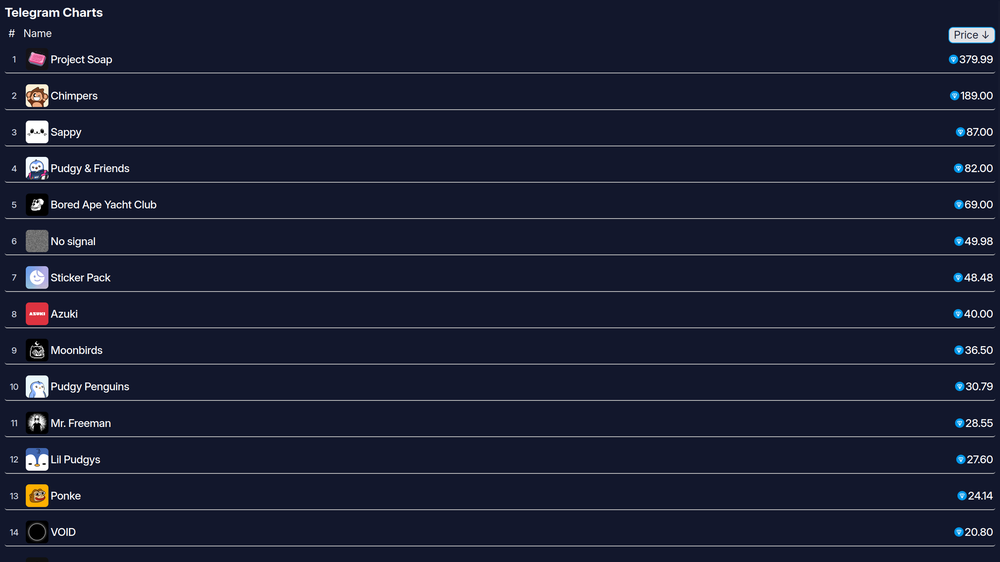

# ⚛️ Frontend
React + Vite + TypeScript project.
## 🚀 Quick Start
### 1. Clone the repository
```bash
git clone https://github.com/zeroxSasha/telegram-charts-frontend.git
cd telegram-charts-frontend
```
### 2. Install dependencies
```bash
npm install
```
### 3. Start development server
```bash
npm run dev
```
Open http://localhost:5173 in your browser.
### 4. Build for production
```bash
npm run build
```
After build, the dist/ folder contains the production-ready site.
### 5. Preview production build
```bash
npm run preview
```
## 📸 Screenshots

## 🛠 Technologies
- ⚛️ React
- ⚡ Vite
- 📘 TypeScript

